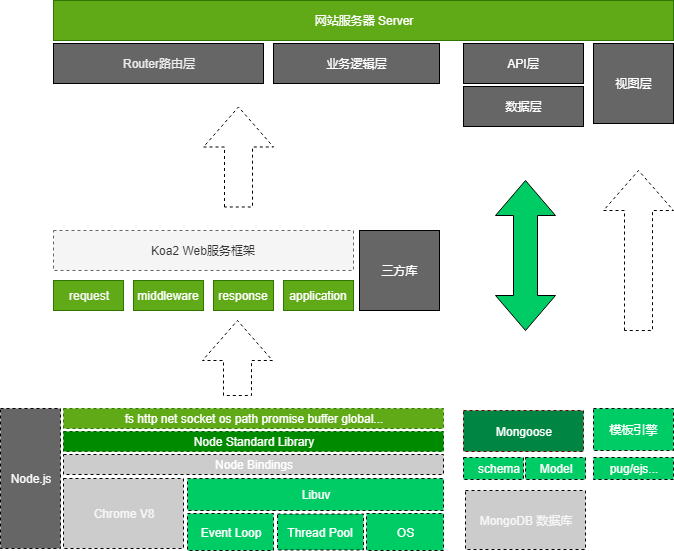

# movies

电影预告片网站 antd koa2 mongo puppeteer webpack4.0 react

## 架构图

<p align="center">
  
</p>

## 服务端

> [服务端](./server/README.md)

## 客户端

> [客户端](./client/README.md)

#### 服务端部署

```
HTTP请求  Nginx  静态资源location         dist/html js css
			    动态数据请求proxy         Nodejs API server
```
- 本地安装 pm2   npm i pm2 -g

- 在服务器: mongoDB nginx nodejs

  - 安装 [nvm](<https://github.com/nvm-sh/nvm> ): curl -o- https://raw.githubusercontent.com/nvm-sh/nvm/v0.34.0/install.sh | bash, nvm --version

  - 安装node: nvm install v8.9.3, npm -v, node -v

  - 安装nginx: sudo apt-get install nginx 

    ```
    nginx -t  # 查看nginx-config 配置文件目录
    
    # 返回结果
    nginx: the configuration file /etc/nginx/nginx.conf syntax is ok
    nginx: configuration file /etc/nginx/nginx.conf test is successful
    /usr/local/webserver/nginx/conf
    ```

- 配置发布脚本 [deploy](./deploy.yaml)

- 配置ssh id_rsa github , 安装git: apt-get install git, 按照deploy.yaml 创/www 容器

  - pm2 deploy deploy.yaml production setup  首次部署
  - pm2 deploy deploy.yaml production update  再次部署

